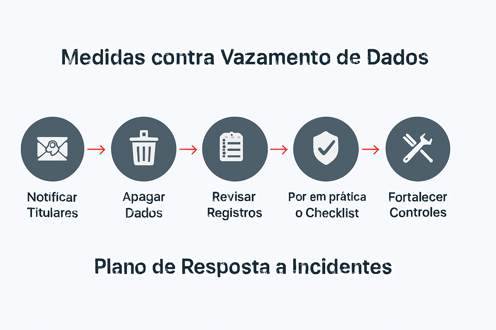

# Política de Privacidade - Projeto Hackathon Forecast Big Data 2025

**Última atualização:** 21 de setembro de 2025

## 1. Introdução
Esta Política de Privacidade descreve como os dados são tratados no âmbito do projeto "Hackathon Forecast Big Data 2025". Nosso compromisso é garantir a proteção dos dados utilizados, em conformidade com a Lei Geral de Proteção de Dados (LGPD - Lei nº 13.709/2018).

## 2. Dados Coletados
Para o desenvolvimento do modelo preditivo, utilizamos um conjunto de dados de vendas contendo as seguintes informações:
- `loja_id`: Identificador anonimizado da loja.
- `produto_id`: Identificador anonimizado do produto.
- `data_venda`: Data da transação.
- `quantidade_vendida`: Volume de vendas do produto.

**Importante:** Todos os dados utilizados são **anonimizados**, o que significa que não é possível identificar uma pessoa natural a partir deles.

## 3. Finalidade do Tratamento dos Dados
Os dados são utilizados exclusivamente para a seguinte finalidade:
- Treinar um modelo de machine learning para prever a demanda futura de vendas de produtos.

Os dados não serão utilizados para nenhuma outra finalidade, como marketing, análise de perfil de consumo individual ou compartilhamento com terceiros fora do escopo do projeto.

## 4. Medidas de Segurança
Adotamos rigorosas medidas técnicas para proteger os dados, incluindo:
- **Criptografia em Repouso:** Os dados processados são armazenados em formato criptografado usando o algoritmo Fernet.
- **Controle de Acesso:** O acesso ao código-fonte e aos dados brutos é restrito aos membros autorizados da equipe.
- **Minimização de Dados:** Utilizamos apenas os dados estritamente necessários para a finalidade do projeto.

## 5. Direitos dos Titulares
Mesmo trabalhando com dados anonimizados, o projeto respeita os princípios da LGPD. Caso este projeto evolua para utilizar dados pessoais, garantiremos todos os direitos aos titulares, como acesso, correção, anonimização e eliminação dos seus dados.

## 6. Contato
Para dúvidas sobre esta Política de Privacidade, entre em contato com a equipe do projeto através do repositório no GitHub. 

